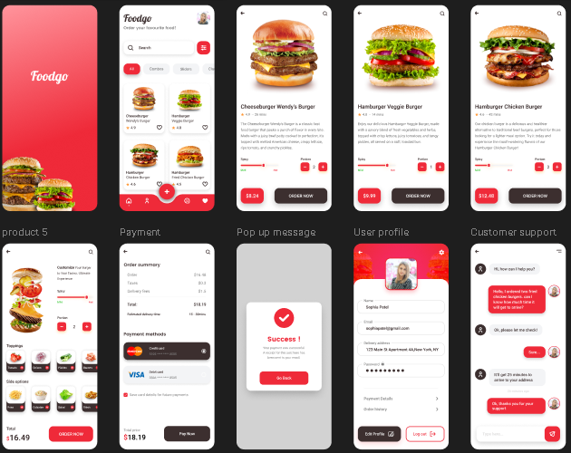

Restaurant Mobile App (React Native + Expo)

Overview

This is a Restaurant Mobile Application built using React Native with Expo. The app fetches menu items from a website API, allows users to place food orders, and provides a chat feature for direct communication with restaurant management.

Features:

Cross-platform mobile application (Android & iOS)

Fetches live restaurant menu from backend API

Displays food items with images, prices, and descriptions

Users can place orders through the mobile app

Real-time chat with restaurant management

Order status handling

Secure and scalable API integration

Clean and responsive user interface

Tech Stack

React Native

Expo

Expo Router / React Navigation

Axios / Fetch API

Context API / Redux (if applicable)

WebSocket / Firebase / Chat API

Installation
1. Clone the Repository
git clone https://github.com/Mismail9961/ResturantApp.git
cd ResturantApp

2. Install Dependencies
npm install

3. Start the Expo Server
npx expo start

4. Run the App

Scan the QR code using Expo Go

Or run on Android/iOS emulator

API Integration

The app communicates with a backend website API to handle:

Menu and product listings

Order creation and management

Chat messages between users and management

Sample API Response
{
  "id": 1,
  "name": "Chicken Burger",
  "price": 450,
  "image": "https://example.com/burger.jpg",
  "description": "Juicy grilled chicken burger"
}

Chat Feature

The built-in chat feature allows users to communicate directly with restaurant management for:

Order-related queries

Custom food requests

Customer support

Project Structure
restaurant-app/
├── app/
│   ├── (tabs)/
│   ├── products/
│   ├── cart/
│   ├── chat/
│   └── index.tsx
├── assets/
├── components/
├── services/
│   └── api.js
├── hooks/
├── utils/
└── package.json

Environment Variables

Create a .env file in the root directory:

EXPO_PUBLIC_API_URL=https://your-api-url.com

Future Enhancements

Online payment gateway integration

Push notifications

Order tracking system

User authentication

Admin dashboard

Contributing:

Contributions are welcome.
Please fork the repository, create a new branch, and submit a pull request.

Author:

Sheikh Muhammad Ismail
Full Stack / Native Developer